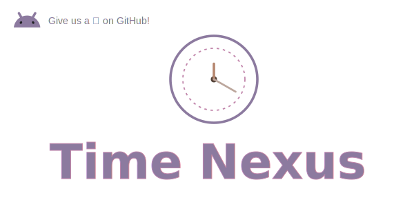

# TimeStats 耗时统计库

<div align="center">
  
</div>


> Every optimization begins with measurement.
>
> 每一次优化，都始于对时间的测量。

## 一、简介

在性能优化领域，最容易被忽略的问题往往不是代码本身，而是缺少可靠的数据。

开发过程中，我们经常需要回答这样的问题：

 - 一个方法到底执行了多久？
 - 某段逻辑是否存在性能瓶颈？
 - 优化之后到底提升了多少？
 - 多次执行后的平均耗时是多少？
 - 极端情况下的耗时表现如何？

然而在实际项目中，这类统计往往通过大量重复代码完成：

```kotlin
val start = System.nanoTime()

task()

val cost = System.nanoTime() - start
```

`TimeStats` 诞生的目的，就是把这些零散且重复的工作统一起来，并专注于耗时统计这一件事情：

提供统一的时间模型与简洁的 API，从简单的代码执行时间测量，到平均值、中位数、P95、P99 等性能指标分析。

---

## 二、特性

- 基于 `System.nanoTime()` 实现高精度时间测量
- 支持同步代码与协程代码耗时统计
- 支持执行结果与耗时同时返回（`MeasureResult`）
- 支持 `MeasureDuration` 与 Kotlin `Duration` 互操作
- 支持 Average、Median、P50、P95、P99 统计分析
- 零第三方运行时依赖

## 三、SDK 适用范围

| 项目         | 要求                                      |
|------------|-----------------------------------------|
| Min SDK    | 19（Android 4.4）及以上                      |
| JVM Target | 1.8                                     |
| Kotlin     | 1.6+（使用协程 API 时需要 `kotlinx-coroutines`） |

---

## 四、集成方式

### 1. 添加仓库

在项目根 `settings.gradle` 或 `build.gradle` 中配置 JitPack：

```groovy
maven {
    url 'https://jitpack.io'
}
```

### 2. 添加依赖

Groovy：

```groovy
dependencies {
    implementation 'com.github.starseaway:time-stats:1.0.0'
}
```

Kotlin DSL：

```kotlin
dependencies {
    implementation("com.github.starseaway:time-stats:1.0.0")
}
```

---

## 五、快速开始

### 1. 测量同步代码耗时

Kotlin 调用：

```kotlin
// 仅测量耗时
val duration = measureTime {
    heavyWork()
}
println(duration.toReadableString())

// 同时获取执行结果
val result = measureTimeWithResult {
    computeValue()
}
println("value = ${result.value}, duration = ${result.duration.toMsString()}")
```

Java 调用：

```java
import com.xinyi.timestats.TimeStats;
import com.xinyi.timestats.model.MeasureDuration;
import com.xinyi.timestats.model.MeasureResult;

private void test() {
    MeasureDuration duration = TimeStats.measureTime(() -> heavyWork());
    LogUtil.d(duration.toReadableString());

    MeasureResult<Integer> result = TimeStats.measureTimeWithResult(() -> computeValue());
    LogUtil.d("value = " + result.getValue() + ", duration = " + result.getDuration().toMsString());
}
```

### 2. 测量对象相关操作

Kotlin 调用：

```kotlin
val list = mutableListOf<Int>()

val duration = list.measureTime {
    repeat(100_000) { index ->
        it.add(index)
    }
}
println("耗时：${duration.toMsString()}")
```

Java 调用：

```java
import com.xinyi.timestats.TimeStats;
import com.xinyi.timestats.model.MeasureDuration;
import java.util.ArrayList;
import java.util.List;

private void test() {
    List<Integer> list = new ArrayList<>();
    MeasureDuration duration = TimeStats.measureTime(list, it -> {
        for (int i = 0; i < 100_000; i++) {
            it.add(i);
        }
    });
    LogUtil.d(duration.toMsString());
}
```

### 3. 测量协程耗时

> 协程 API（`measureSuspendTime` 等）为 Kotlin 挂起函数设计，**仅适用于 Kotlin**，Java 就使用 `measureTime` 测量同步逻辑。

Kotlin 调用：

```kotlin
// 需要在协程作用域内调用
val duration = measureSuspendTime {
    fetchRemoteData()
}

val result = apiClient.measureSuspendTimeWithResult {
    it.request()
}
println("${result.value}, ${result.duration}")
```

### 4. 多次采样与统计分析

Kotlin 调用：

```kotlin
val samples = List(100) {
    measureTime { targetTask() }
}

println("平均：${samples.average().toReadableString()}")
println("中位数：${samples.median().toReadableString()}")
println("P95：${samples.p95().toReadableString()}")
println("P99：${samples.p99().toReadableString()}")
```

Java 调用：

```java
import com.xinyi.timestats.TimeStats;
import com.xinyi.timestats.extensions.MeasureDurationExtension;
import com.xinyi.timestats.model.MeasureDuration;

import java.util.ArrayList;
import java.util.List;

private void test() {
    List<MeasureDuration> samples = new ArrayList<>();
    // 多次调用 TimeStats.measureTime(...) 填充 samples

    MeasureDuration avg = MeasureDurationExtension.average(samples);
    MeasureDuration p95 = MeasureDurationExtension.p95(samples);
    LogUtil.d("avg = " + avg.toReadableString());
    LogUtil.d("p95 = " + p95.toReadableString());
}
```

---

## 六、设计理念

时间本身无法被优化，能够被优化的，只有时间消耗背后的代码。

而在优化之前，首先需要知道时间究竟流向了哪里。

`TimeStats` 希望成为这个过程中的第一步。

---

## 七、版本记录

### V1.0.0 (2026-06-15)

- 首次发布，包含同步与协程耗时统计
- 统一返回 `MeasureDuration` 耗时模型，并多单位格式化
- 支持 `MeasureResult` 结果包装
- 支持 Average、Median、P50、P95、P99 统计分析